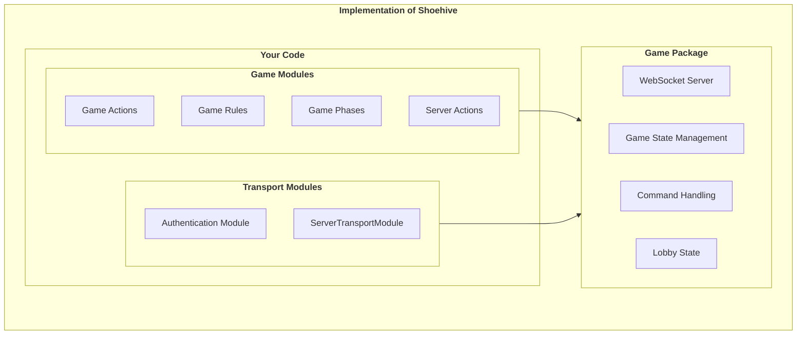

# 🐝 Shoehive - Open Source Multiplayer Game Framework

Shoehive is an **extensible, WebSocket-based multiplayer game framework** designed for real-time, event-driven gameplay. It provides a powerful **player management system, message routing, and structured table handling**, allowing developers to build their own game logic while leveraging a robust core.

## 🚀 Features

✅ **WebSocket-Powered** – Real-time, low-latency communication.  
✅ **Modular Player System** – Extend and customize player behavior.  
✅ **Table & Seat Management** – Players can sit at one table and occupy multiple seats.  
✅ **Hybrid Message Routing** – Supports command-based actions and event-driven mechanics.  
✅ **Lightweight & Scalable** – Designed for high-performance multiplayer games.  
✅ **Open Source & Flexible** – Easily integrates with custom game logic.  

## 📐 Implementation Diagram


## 📦 Installation

```bash
npm i shoehive
```

## 🤝 Contributing

Contributions are welcome! Please feel free to submit issues and pull requests.

## 📄 License

This project is licensed under the MIT License. See the [LICENSE](LICENSE) file for details.

