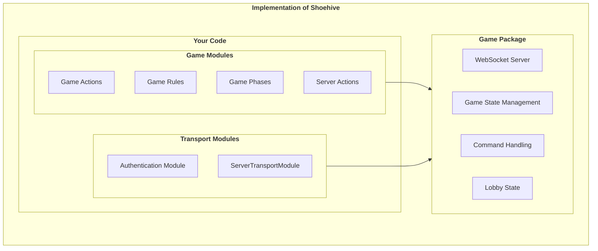

# 🐝 Shoehive Quick Start Guide

Welcome to Shoehive, the flexible WebSocket-based multiplayer game framework. This quick start guide will help you set up your first Shoehive game server and understand the core concepts.

## 📋 Table of Contents

1. [Installation](#-installation)
2. [Basic Setup](#-basic-setup)
3. [Understanding Core Concepts](#-understanding-core-concepts)
4. [Using Transport Modules](#-using-transport-modules)
5. [Creating Game Logic](#-creating-game-logic)
6. [Event Handling](#-event-handling)
7. [Common Patterns](#-common-patterns)

## 🛠️ Installation

Install Shoehive using npm:

```bash
npm install shoehive
```

Or using yarn:

```bash
yarn add shoehive
```

## 🚀 Basic Setup

Here's a minimal example to set up a Shoehive game server:

```typescript
import * as http from 'http';
import { createGameServer } from 'shoehive';

// Create an HTTP server
const server = http.createServer();

// Create the game server
const gameServer = createGameServer(server);

// Start the server
const PORT = process.env.PORT || 3000;
server.listen(PORT, () => {
  console.log(`Game server running on port ${PORT}`);
});
```

## 🧩 Understanding Core Concepts

Shoehive is built around a few core concepts:

### Players

Players represent connected clients. Each player:
- Has a unique ID
- Can join tables
- Can sit at seats within tables
- Can have custom attributes

```typescript
// Example of working with players
const player = gameServer.wsManager.getPlayer('player-id');
if (player) {
  // Set custom attributes
  player.setAttribute('score', 100);
  player.setAttribute('avatar', 'https://example.com/avatar.png');
  
  // Send a message to the player
  player.sendMessage({
    type: 'gameUpdate',
    data: { message: 'Your turn!' }
  });
}
```

### Tables

Tables group players together and represent a specific game instance:
- Tables have a unique ID
- Tables have seats that players can occupy
- Tables have a state (WAITING, ACTIVE, ENDED)

```typescript
// Creating a table
const table = gameServer.gameManager.createTable('game-id', { 
  config: { totalSeats: 4, maxSeatsPerPlayer: 1 } 
});

// Player joining a table
table.addPlayer(player);

// Player sitting at a seat
table.sitPlayerAtSeat(player.id, 0);

// Getting table state
const state = table.getState();
```

### Events and Message Routing

Shoehive uses an event-based system for communication:
- The EventBus handles internal events
- The MessageRouter processes messages from clients

```typescript
// Register a command handler
gameServer.messageRouter.registerCommandHandler('makeMove', (player, data) => {
  // Handle the player's move
  console.log(`Player ${player.id} made move:`, data);
});

// Listen to an event
gameServer.eventBus.on('playerSeated', (player, table, seatIndex) => {
  console.log(`Player ${player.id} sat at seat ${seatIndex} in table ${table.id}`);
});
```

## 📐 Implementation Diagram

Shoehive is designed to be modular and extensible. The following diagram shows the core components and their relationships when using the base implementations:



## 🔌 Using Transport Modules

Shoehive provides transport modules to handle authentication and server-side operations.

### Authentication

The `AuthModule` handles player authentication:

```typescript
import * as http from 'http';
import { createGameServer, AuthModule } from 'shoehive';

// Create a custom auth module
class MyAuthModule implements AuthModule {
  async authenticatePlayer(request: http.IncomingMessage): Promise<string | null> {
    // Example: extract token from query string
    const url = new URL(request.url || '', `http://${request.headers.host}`);
    const token = url.searchParams.get('token');
    
    // Validate token (in a real app, you'd verify against a database or service)
    if (token === 'valid-token') {
      return 'user-123'; // Return user ID if valid
    }
    
    return null; // Return null if authentication fails
  }
}

// Create an HTTP server
const server = http.createServer();

// Create auth module instance
const authModule = new MyAuthModule();

// Create the game server with auth
const gameServer = createGameServer(server, authModule);
```

### Server Transport

The `ServerTransportModule` handles operations like player balances and bets:

```typescript
import { createGameServer, ServerTransportModule, Player } from 'shoehive';
import { BasicServerTransportModule } from 'shoehive';

// Create server transport module instance
// You can use the built-in BasicServerTransportModule or create your own
const serverTransport = new BasicServerTransportModule();

// If using BasicServerTransportModule, you can set initial balances
serverTransport.setPlayerBalance('player-123', 1000);

// Create the game server with auth and server transport
const gameServer = createGameServer(server, authModule, serverTransport);

// Example of using server transport in game logic
async function processBet(player: Player, amount: number) {
  try {
    // Check balance
    const balance = await gameServer.transport.server?.getPlayerBalance(player);
    console.log(`Player ${player.id} balance: ${balance}`);
    
    // Create bet
    const betId = await gameServer.transport.server?.createBet(player, amount);
    console.log(`Created bet ${betId}`);
    
    // Game logic to determine outcome...
    const playerWon = Math.random() > 0.5;
    
    if (playerWon) {
      // Mark bet as won
      await gameServer.transport.server?.markBetWon(betId!, amount * 2);
      console.log(`Player won ${amount * 2}`);
    } else {
      // Mark bet as lost
      await gameServer.transport.server?.markBetLost(betId!);
      console.log(`Player lost ${amount}`);
    }
  } catch (error) {
    console.error(`Error processing bet:`, error);
  }
}
```

## 🎮 Creating Game Logic

To create custom game logic, you'll typically:

1. Define your game states and rules
2. Register command handlers for player actions
3. Use the event system to respond to changes

Here's a simplified example of a number guessing game:

```typescript
import { createGameServer, Player, Table } from 'shoehive';

// Define game-specific attributes and handlers
function initializeNumberGuessingGame(gameServer) {
  // Register a handler for creating a game
  gameServer.messageRouter.registerCommandHandler('createGame', (player, data) => {
    // Create a new table
    const table = gameServer.gameManager.createTable('number-guessing', {
      config: { totalSeats: 2, maxSeatsPerPlayer: 1 }
    });
    
    // Add player to table
    table.addPlayer(player);
    
    // Initialize game state
    table.setAttribute('targetNumber', Math.floor(Math.random() * 100) + 1);
    table.setAttribute('attempts', 0);
    table.setAttribute('maxAttempts', 10);
    
    // Notify player
    player.sendMessage({
      type: 'gameCreated',
      tableId: table.id
    });
  });
  
  // Register a handler for making a guess
  gameServer.messageRouter.registerCommandHandler('makeGuess', (player, data) => {
    if (!data.guess || typeof data.guess !== 'number') return;
    
    const table = player.getTable();
    if (!table) return;
    
    const targetNumber = table.getAttribute('targetNumber');
    const attempts = table.getAttribute('attempts');
    const maxAttempts = table.getAttribute('maxAttempts');
    
    // Increment attempts
    table.setAttribute('attempts', attempts + 1);
    
    // Check guess
    if (data.guess === targetNumber) {
      // Player won
      player.sendMessage({
        type: 'guessResult',
        correct: true,
        message: `Correct! The number was ${targetNumber}`
      });
      
      // End game
      table.setAttribute('state', 'ENDED');
      gameServer.eventBus.emit('gameEnded', table, player.id);
    } else {
      // Incorrect guess
      const hint = data.guess < targetNumber ? 'higher' : 'lower';
      
      player.sendMessage({
        type: 'guessResult',
        correct: false,
        message: `Wrong! Try something ${hint}`,
        attemptsLeft: maxAttempts - (attempts + 1)
      });
      
      // Check if max attempts reached
      if (attempts + 1 >= maxAttempts) {
        player.sendMessage({
          type: 'gameOver',
          message: `Game over! The number was ${targetNumber}`
        });
        
        // End game
        table.setAttribute('state', 'ENDED');
        gameServer.eventBus.emit('gameEnded', table);
      }
    }
  });
}
```

## 📢 Event Handling

Shoehive provides an event system for handling game state changes and other events:

```typescript
// Listen for specific events
gameServer.eventBus.on('playerJoinedTable', (player, table) => {
  // Notify other players in the table
  table.getPlayers().forEach(p => {
    if (p.id !== player.id) {
      p.sendMessage({
        type: 'playerJoined',
        playerId: player.id
      });
    }
  });
});

// Emit custom events
gameServer.eventBus.emit('roundStarted', table, {
  roundNumber: 1,
  startTime: Date.now()
});
```

## 💡 Common Patterns

### Game State Management

It's a good practice to define clear game states and transitions:

```typescript
// Define game states
enum GameState {
  WAITING_FOR_PLAYERS = 'waitingForPlayers',
  ROUND_STARTING = 'roundStarting',
  ACTIVE = 'active',
  ROUND_ENDED = 'roundEnded',
  GAME_OVER = 'gameOver'
}

// Set the state on the table
table.setAttribute('gameState', GameState.WAITING_FOR_PLAYERS);

// Function to transition states
function transitionState(table, newState, data = {}) {
  const previousState = table.getAttribute('gameState');
  table.setAttribute('gameState', newState);
  
  // Emit state change event
  gameServer.eventBus.emit('gameStateChanged', table, {
    previousState,
    newState,
    ...data
  });
  
  // Notify all players
  table.getPlayers().forEach(player => {
    player.sendMessage({
      type: 'stateChanged',
      state: newState,
      data
    });
  });
}
```

### Player Reconnection Handling

Handle player reconnections gracefully:

```typescript
gameServer.eventBus.on('playerReconnected', (player) => {
  const table = player.getTable();
  if (table) {
    // Send the current game state to the reconnected player
    const gameState = table.getAttribute('gameState');
    const gameData = table.getAttribute('gameData');
    
    player.sendMessage({
      type: 'gameState',
      state: gameState,
      data: gameData
    });
  }
});
```

## 🔗 Additional Resources
- [Advanced Events](https://github.com/jtay/shoehive/tree/main/docs/advanced-events.md)
- [Transport Modules](https://github.com/jtay/shoehive/tree/main/docs/transport-modules.md)
- [Creating Custom Games](https://github.com/jtay/shoehive/tree/main/docs/creating-games.md)
- [Player Attributes](https://github.com/jtay/shoehive/tree/main/docs/player-attributes.md)
- [API Documentation](https://github.com/jtay/shoehive/tree/main/docs/api-reference.md)

Happy gaming with Shoehive! 🎮 